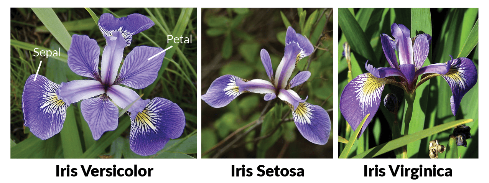

# "Hello World" in ML with GUI

I'm new to ML and I want to Evaluate my knowledge so I created this program using Python.
:octocat: :sparkles: :rocket:

## Problem :question:

The Iris flower data set or Fisher's Iris data set is a multivariate data set introduced by the British statistician, eugenicist, and biologist Ronald Fisher in his 1936 paper The use of multiple measurements in taxonomic problems as an example of linear discriminant analysis. It is sometimes called Anderson's Iris data set because Edgar Anderson collected the data to quantify the morphologic variation of Iris flowers of three related species. Two of the three species were collected in the Gaspé Peninsula "all from the same pasture, and picked on the same day and measured at the same time by the same person with the same apparatus". Fisher's paper was published in the journal, the Annals of Eugenics, creating controversy about the continued use of the Iris dataset for teaching statistical techniques today.

The data set consists of 50 samples from each of three species of Iris (Iris setosa, Iris virginica and Iris versicolor). Four features were measured from each sample: the length and the width of the sepals and petals, in centimeters. Based on the combination of these four features, Fisher developed a linear discriminant model to distinguish the species from each other.

### Labels

### Features

### ML Algorithm Used

KNN = K Nearest Neibors Algorithm(Category-Classification/Supervised ML)

### Model Accuracy

ML Model used in this Program is 96.67% Accurate

## Usage :mag_right:

No Uasge this program created to evaluate my ML,Tkinter and Python OOP knowledge :smiley:

## Built With :wrench:

* [Anaconda](http://www.dropwizard.io/1.0.2/docs/) - Compiler
* [VScode](https://code.visualstudio.com/) - Python IDE

## Known Bugs :beetle:

Issue in GUI - Predictions get Overlapped.(fix it and push,anyone who can code well :laughing: )

## Acknowledgments :muscle:

* Hat tip to anyone whose code was used
